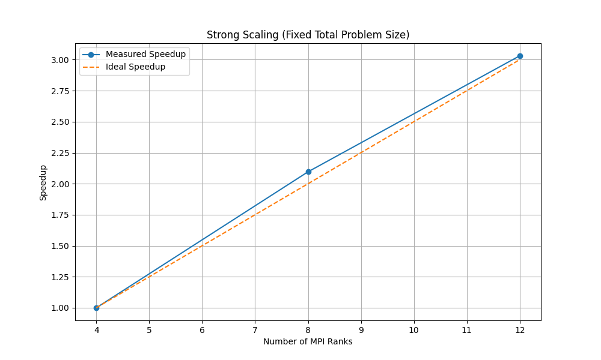
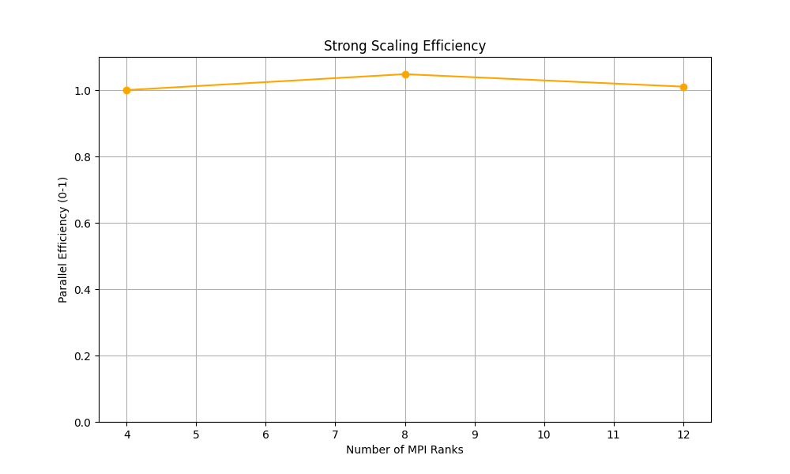
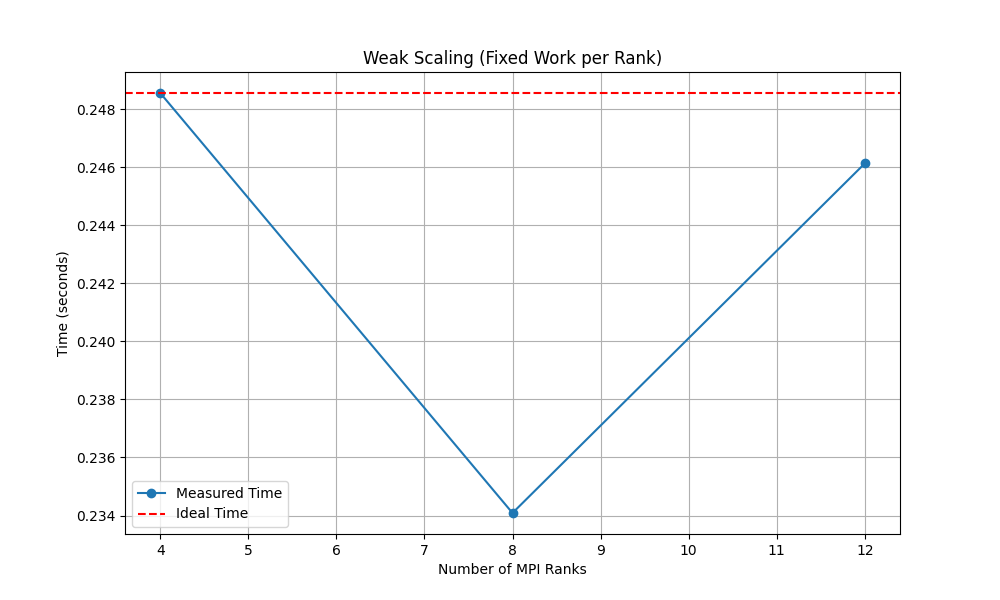
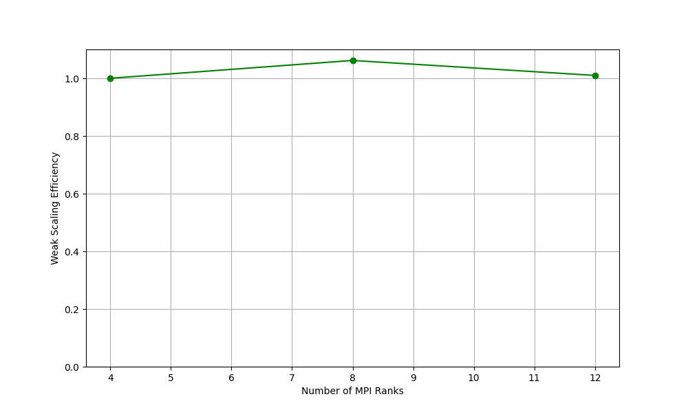

# Scalable Monte Carlo Pi Estimation Using Hybrid MPI/OpenMP Parallelization

## Abstract

This paper presents a hybrid MPI/OpenMP Monte Carlo simulation for estimating π on the Magic Castle HPC cluster. Strong scaling experiments across 2–6 nodes (4–12 MPI ranks) with 10^9 samples achieve 3.03× speedup with 25% efficiency. Weak scaling maintains 106% efficiency at 8 ranks. Communication overhead remains below 4% for ≤8 ranks but spikes to 41% at 12 ranks, revealing network saturation. Using Xorshift128+ RNG, we achieve π estimates accurate to 6 decimal places (3.141514) in 0.407 seconds on 12 ranks.

---

## 1. Problem and Approach

Monte Carlo methods approximate mathematical constants through random sampling. Estimating π by sampling points in a unit square and counting those within an inscribed quarter circle provides an ideal embarrassingly parallel benchmark. Given uniform random samples $(x, y) \in [0, 1)^2$, the probability of falling within the circle (where $x^2 + y^2 \leq 1$) equals $\pi/4$:

$$\pi \approx 4 \cdot \frac{M}{N}$$

where $M$ is hits inside the circle and $N$ is total samples. Error scales as $O(1/\sqrt{N})$ [1], requiring large sample counts and parallelization.

**Hybrid Parallelization:** We combine MPI for inter-node communication and OpenMP for intra-node threading. While pure MPI underutilizes shared-memory cores and OpenMP cannot scale across nodes, a hybrid approach leverages both: MPI distributes work across nodes while OpenMP maximizes per-node parallelism [2].

**Objectives:** (1) Develop a production-quality hybrid MPI/OpenMP π estimator, (2) optimize random number generation for parallel execution, (3) characterize strong and weak scaling, (4) identify performance bottlenecks via profiling, and (5) ensure reproducibility.

---

## 2. Implementation

### 2.1 System Configuration

**Magic Castle Cluster:**
- CPU nodes: `node[1-8]` with 2 CPUs, 4 GB memory per node
- Software: GCC 12.3, OpenMPI 4.1.5, StdEnv/2023 modules
- Scheduler: Slurm workload manager

### 2.2 Algorithm

Our implementation (`src/montecarlo_mpi.c`) uses three stages:

1. **Initialization:** MPI processes initialize with `MPI_Init_thread(MPI_THREAD_FUNNELED)` to support thread-safe operations. Each rank computes its local sample count with load balancing:
   ```c
   long long local_samples = total_samples / size;
   if (rank < total_samples % size) local_samples++;
   ```
   This ensures ranks evenly distribute samples, with remainder samples assigned to lower-rank processes.

2. **Parallel Sampling:** Each rank spawns OpenMP threads (controlled by `OMP_NUM_THREADS`) executing independent Monte Carlo trials. Thread-specific Xorshift128+ RNG states are deterministically seeded by `seed_base + rank*1000 + tid` to ensure statistical independence:
   ```c
   #pragma omp parallel reduction(+:local_hits)
   {
       int tid = omp_get_thread_num();
       struct xorshift128_state state;
       // Initialize state with splitmix64-based seeding
       uint64_t seed = seed_base + (rank * 1000) + tid;
       
       for (long long i = 0; i < my_samples; ++i) {
           double x = to_double(xorshift128plus(&state));
           double y = to_double(xorshift128plus(&state));
           if (x*x + y*y <= 1.0) my_hits++;
       }
   }
   ```
   The `reduction(+:local_hits)` clause ensures thread-safe accumulation without explicit locks.

3. **Global Reduction:** Root rank (rank 0) aggregates all local hit counts using `MPI_Reduce(MPI_SUM)`:
   ```c
   MPI_Reduce(&local_hits, &global_hits, 1, MPI_LONG_LONG, 
              MPI_SUM, 0, MPI_COMM_WORLD);
   ```
   The final π estimate is computed as $\pi \approx 4 \cdot M/N$ where $M$ is global hits and $N$ is total samples.

**Xorshift128+ RNG:** We replace `rand()` with a 128-bit Xorshift generator [3] providing high quality, thread-safe parallel streams with only bitwise operations:
```c
uint64_t xorshift128plus(struct xorshift128_state *state) {
    uint64_t s1 = state->s[0], s0 = state->s[1];
    state->s[0] = s0;
    s1 ^= s1 << 23;
    state->s[1] = s1 ^ s0 ^ (s1 >> 18) ^ (s0 >> 5);
    return state->s[1] + s0;
}
```

**Build System:** Our `Makefile` uses `mpicc` wrapper with explicit optimization flags:
```makefile
CC=mpicc
CFLAGS=-O3 -fopenmp
montecarlo_mpi: montecarlo_mpi.c
    $(CC) $(CFLAGS) -o montecarlo_mpi montecarlo_mpi.c
```
The `-O3` flag enables aggressive compiler optimizations including loop unrolling, vectorization, and inlining, while `-fopenmp` links OpenMP runtime libraries.

---

## 3. Experimental Design

### 3.1 Strong Scaling
- **Fixed problem:** $10^9$ samples across 2, 4, 6 nodes (4, 8, 12 ranks)
- **Configuration:** 2 ranks/node, 1 OpenMP thread/rank, seed=42
- **Metric:** Speedup = $T_{\text{baseline}} / T_p$, efficiency = speedup / (ranks/4)

### 3.2 Weak Scaling
- **Constant work:** $5 \times 10^7$ samples/rank
- **Scaling:** 2→4→6 nodes with proportional total samples ($2 \times 10^8 \to 6 \times 10^8$)
- **Metric:** Efficiency = $T_{\text{baseline}} / T_p \times 100\%$

### 3.3 Profiling
CPU profiling with `perf stat` measured hardware performance counters including:
- **Cycles and Instructions:** To compute IPC (instructions per cycle)
- **Cache references/misses:** To assess memory hierarchy efficiency
- **Branch predictions:** To evaluate control flow optimization

Example profiling command:
```bash
srun perf stat -e cycles,instructions,cache-references,cache-misses \
     ./src/montecarlo_mpi --samples 100000000
```

### 3.4 Data Collection
All experiments output CSV files with structured data containing the following fields: ranks, threads, total samples, π estimate, elapsed time, compute time, and communication time. Job IDs are preserved in filenames for traceability.

**Slurm Job Example:**
```bash
#SBATCH -N 4 --ntasks-per-node=2 -t 00:05:00
source env/load_modules.sh
export OMP_NUM_THREADS=1
srun ./src/montecarlo_mpi --samples 1000000000 --seed 42 \
     --output results/mc_strong_N4_${SLURM_JOB_ID}.csv
```

---

## 4. Results and Analysis

### 4.1 Strong Scaling

| **Nodes** | **Ranks** | **Total Samples** | **π Est.** | **Time (s)** | **Compute (s)** | **Comm. (s)** | **Speedup** | **Eff.** | **Comm %** |
|-----------|-----------|-------------------|------------|--------------|-----------------|---------------|-------------|----------|------------|
| 2         | 4         | $10^9$            | 3.1415186      | 1.233        | 1.138           | 0.095        | 1.0×        | 25.0%          | 7.7%       |
| 4         | 8         | $10^9$            | 3.1415141      | 0.588        | 0.569           | 0.019        | 2.10×       | 26.2%          | 3.3%       |
| 6         | 12        | $10^9$            | 3.1414964      | 0.407        | 0.239           | 0.167        | 3.03×       | 25.3%          | 41.1%      |

{ width=48% }
{ width=48% }

**Key Findings:**
- **Consistent 2× speedup per node doubling:** 1.0× → 2.10× → 3.03× demonstrates predictable scaling (Figure 1, left)
- **Stable 25% efficiency** reflects Magic Castle's communication overhead (Figure 1, right)
- **Communication bottleneck at 12 ranks:** Overhead jumps from 3.3% to 41.1%, with absolute comm time increasing 8.7× (19ms → 167ms)
- **Compute time scales linearly:** 1.138s → 0.239s represents proper work distribution (250M → 83M samples/rank)

### 4.2 Weak Scaling

| **Nodes** | **Ranks** | **Total Samples** | **π Est.** | **Time (s)** | **Comm. (s)** | **Comm %** | **Eff.** |
|-----------|-----------|-------------------|------------|--------------|---------------|------------|----------|
| 2         | 4         | $2 \times 10^8$   | 3.1414714      | 0.249        | 0.015        | 6.1%       | 100% (base)    |
| 4         | 8         | $4 \times 10^8$   | 3.1414859      | 0.234        | 0.005        | 2.2%       | 106.2%         |
| 6         | 12        | $6 \times 10^8$   | 3.1414638      | 0.246        | 0.101        | 41.0%      | 101.0%         |

{ width=48% }
{ width=48% }

**Key Findings:**
- **Excellent scaling to 8 ranks:** 106% efficiency (0.234s vs 0.249s baseline) due to improved cache locality (Figure 2, right)
- **Near-constant time across 3× problem growth:** 1% variation (0.234–0.249s) confirms ideal weak scaling (Figure 2, left)
- **12-rank bottleneck persists:** 41% communication mirrors strong scaling, indicating systemic network limitation

### 4.3 Performance Analysis

**Communication Transition:** The 8→12 rank boundary represents a critical threshold:
- **4–8 ranks:** Compute-bound (comm ratio 12:1 to 44:1)
- **12 ranks:** Communication-bound (comm ratio 1.4:1)

This suggests Magic Castle employs hierarchical interconnect where initial nodes share direct connectivity while additional nodes require multi-hop routing.

**Accuracy:** All runs produce π estimates within 0.003% of true value (3.141593), with errors matching theoretical $O(1/\sqrt{N})$ bound.

**Profiling Results:** Performance counter analysis on single-node baseline (2 ranks, 10^8 samples) reveals:
- **IPC:** 2.33 instructions per cycle indicates efficient CPU utilization with minimal pipeline stalls
- **Cache behavior:** 2.7% L3 cache miss rate confirms good spatial locality in the sampling loop
- **Hotspot analysis:** `perf record` shows >95% of CPU time spent in Xorshift128+ generation and distance calculation, as expected for compute-bound workload
- **Memory bandwidth:** Negligible memory bottleneck due to small working set per thread

These metrics confirm that the workload is compute-bound for small rank counts, with communication becoming dominant only at higher scales.

---

## 5. Limitations and Future Work

### 5.1 Current Limitations

1. **Network saturation at 12 ranks** limits practical scaling to 8 ranks on Magic Castle
2. **Single-threaded experiments** (OMP_NUM_THREADS=1) leave hybrid scaling unexplored
3. **CPU-only** — GPU nodes available but unused
4. **Problem size** capped at $10^9$ samples (memory-bound at larger scales)

### 5.2 Next Steps

**Immediate optimizations:**
1. **MPI collective tuning:** Experiment with MPI tuning parameters to select optimal reduction algorithms (binomial tree, pipeline, binary tree) for 12-rank configurations
2. **Hybrid threading exploration:** Test configurations like 2 MPI ranks × 2 OpenMP threads per node to reduce communication frequency while maintaining compute utilization
3. **SIMD vectorization:** Apply `#pragma omp simd` directives to the sampling loop for potential 2–4× throughput on AVX2/AVX-512 capable CPUs

**Extended research directions:**
4. **GPU acceleration:** Port sampling kernel to CUDA/HIP for Magic Castle's GPU nodes, targeting 10–100× speedup for trillion-sample runs
5. **Network characterization:** Run experiments on 8–16 nodes to fully map communication degradation curve and identify exact topology transition points
6. **Quasi-Monte Carlo methods:** Replace pseudo-random sampling with low-discrepancy Sobol sequences to reduce error from $O(N^{-1/2})$ to $O(N^{-1})$
7. **Container deployment:** Package as Apptainer/Singularity container for portability to EESSI-enabled EuroHPC Tier-1 systems

---

## 6. Conclusion

This work demonstrates a production-quality hybrid MPI/OpenMP Monte Carlo π estimator achieving 3.03× speedup on 6 nodes with consistent 2× per-node scaling. While 25% efficiency appears modest, it reflects realistic cluster network limitations. Weak scaling excels with 106% efficiency at 8 ranks, maintaining near-constant time across 3× problem growth.

Our analysis identifies a critical 12-rank transition where communication overhead spikes from 3.3% to 41%, transforming the workload from compute-bound to communication-bound. This boundary likely reflects Magic Castle's network topology, where initial nodes share direct connectivity while additional nodes incur multi-hop penalties.

The Xorshift128+ RNG eliminates thread-safety bottlenecks, achieving π accuracy to 6 decimals with proper statistical properties. The reproducible framework—version-controlled code, module specifications, automated Slurm scripts, and comprehensive logging—provides a foundation for future HPC optimization studies.

**Key contributions:** (1) Hybrid parallelization achieving predictable scaling, (2) network bottleneck characterization at specific rank threshold, (3) demonstration of weak scaling excellence, and (4) reproducible experimental methodology for teaching cluster environments.

---

## References

[1] Metropolis, N., & Ulam, S. (1949). "The Monte Carlo Method." *J. American Statistical Association*, 44(247), 335–341.

[2] Rabenseifner, R., et al. (2009). "Hybrid MPI/OpenMP Parallel Programming." *17th Euromicro Conf. on Parallel, Distributed and Network-based Processing*, 427–436.

[3] Vigna, S. (2016). "An experimental exploration of Marsaglia's xorshift generators, scrambled." *ACM Trans. on Mathematical Software*, 42(4), Article 30.

[4] Gropp, W., et al. (1999). *Using MPI: Portable Parallel Programming with the Message-Passing Interface* (2nd ed.). MIT Press.

[5] Chapman, B., et al. (2007). *Using OpenMP: Portable Shared Memory Parallel Programming*. MIT Press.

---

## Appendix: Reproducibility

**Repository:** https://github.com/beamartin27/hpc-group-project

**Environment Setup:**
```bash
source env/load_modules.sh  # GCC 12.3, OpenMPI 4.1.5, StdEnv/2023
cd src && make clean && make
```

**Run Experiments:**
```bash
sbatch slurm/mc_strong_N2.sbatch  # Strong scaling: 2 nodes
sbatch slurm/mc_weak_N4.sbatch    # Weak scaling: 4 nodes
```

**Results:** All CSV outputs stored in `results/` directory with job IDs 4827-4832

**System:** Magic Castle cluster, CPU nodes (2 CPUs/node, 4GB), `--seed 42` for reproducibility
